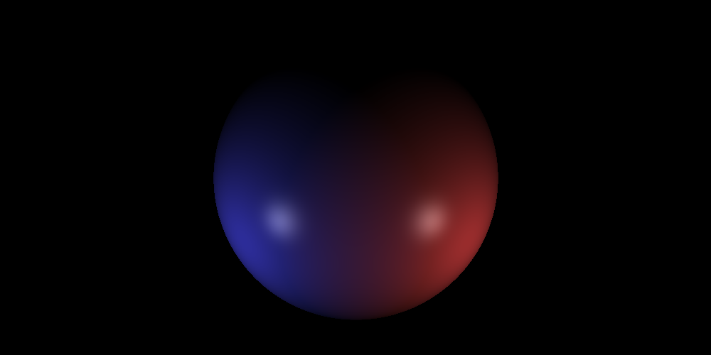
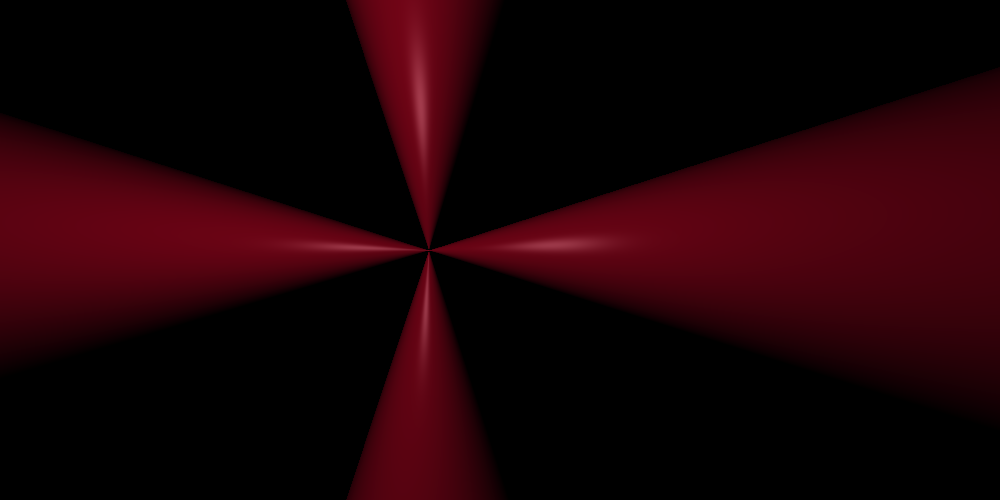
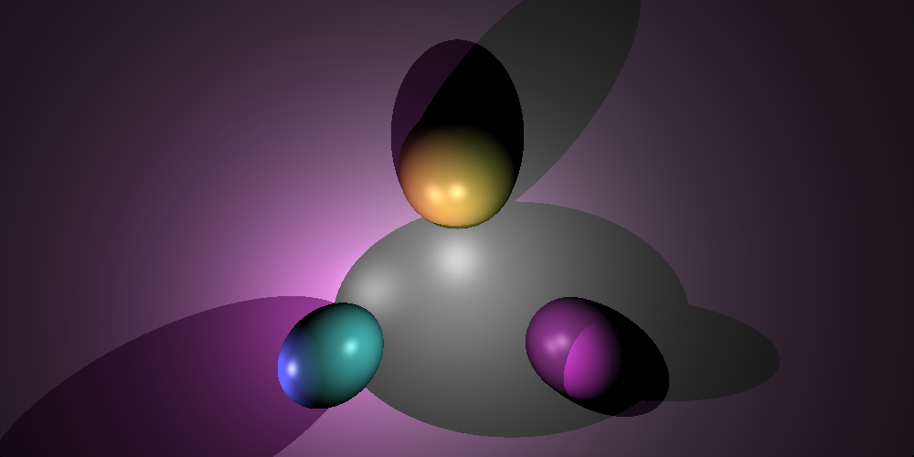
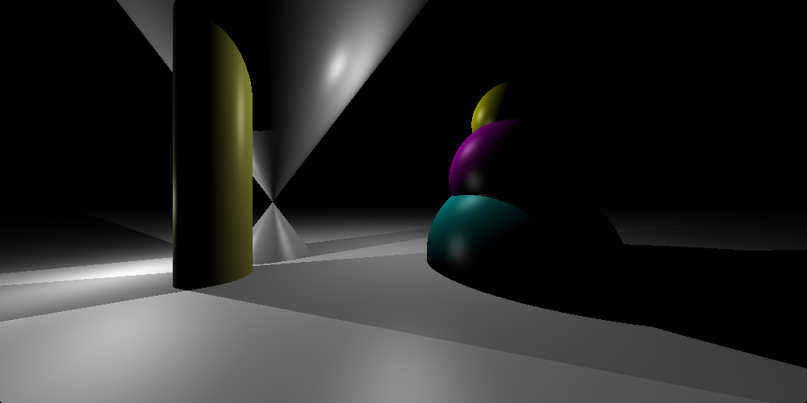
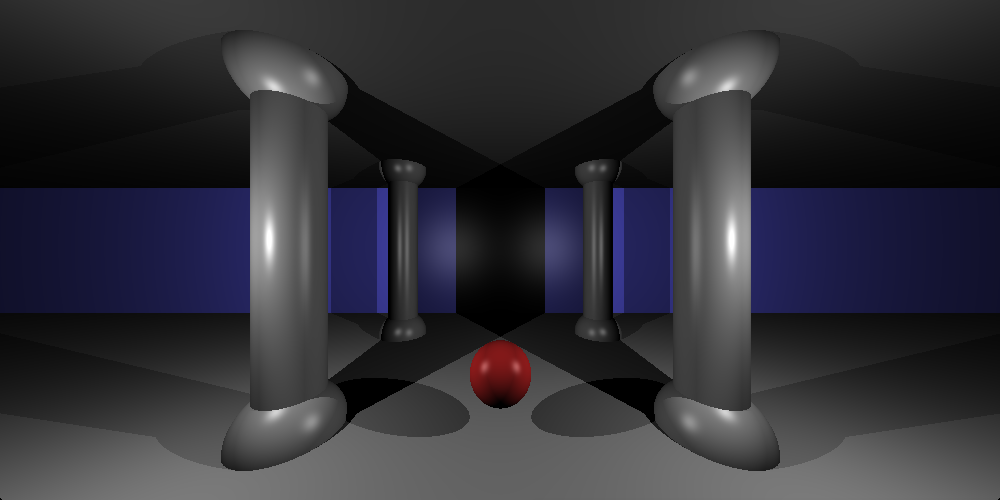

# RTv1 - 42/Unit Factory

This project create program, which emulate Ray Tracing technology. There are sphere, cone, cylinder and plane included to this program.

This project work only MacOS system.
Used graphic "MiniLibX" library.

1. Use "make" to compile program.
2. run ./RTv1 scenes/[choose_file].rtv1 

# CONTROLS:

# Move camera:

'`D`' - OX_up

'`A`' - OX-down

'`SHIFT`' - OY_up

'`CTRL`' - OY-down

'`W`' - OZ_up

'`S`' - OZ-down

# Rotate camera:

'`up`' - Up

'`down`' - Down

'`left`' - Left

'`right`' - Righ

'`>`' - Clockwise

'`<`' -	Anticlock

# Zoom:

'`+`' or '`-`' - zoom

# '`esc`' - Exit
